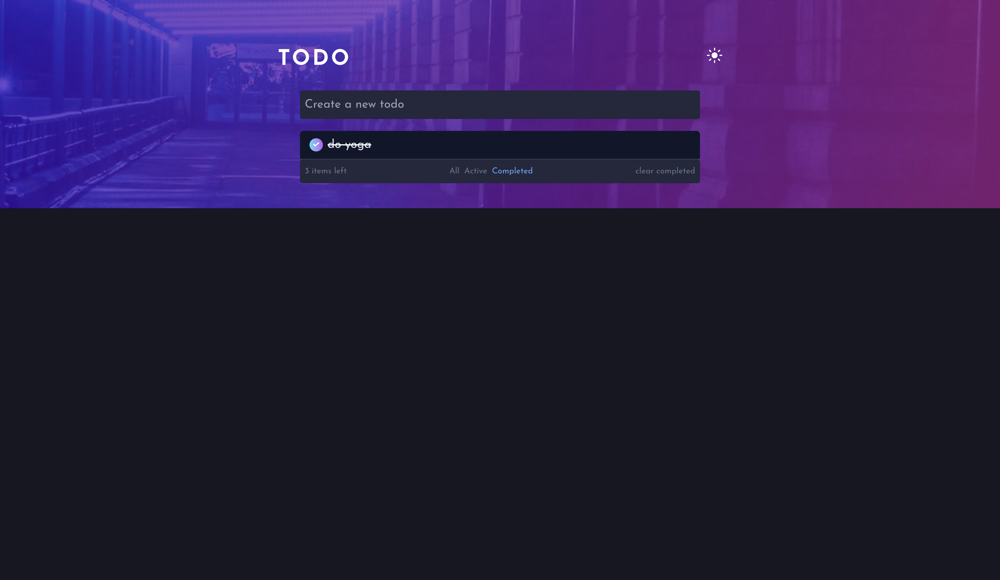
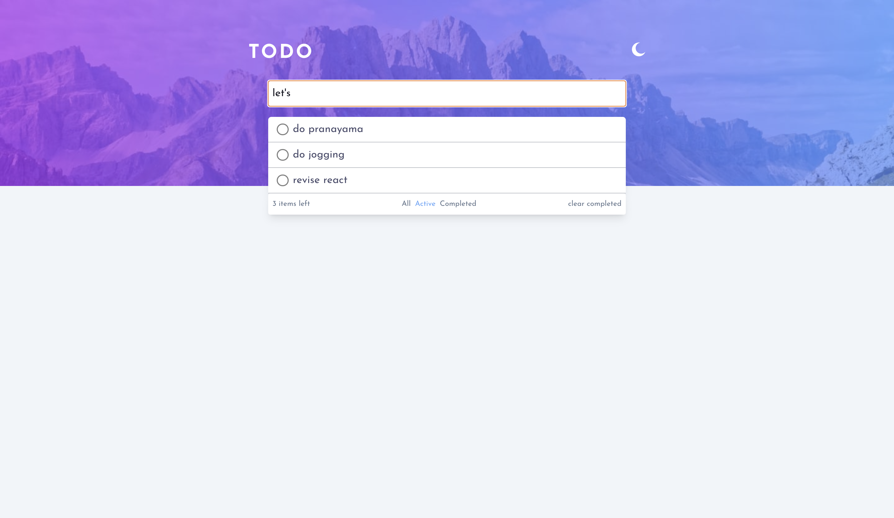
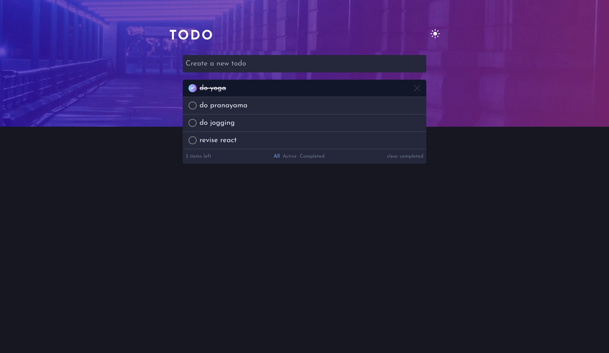
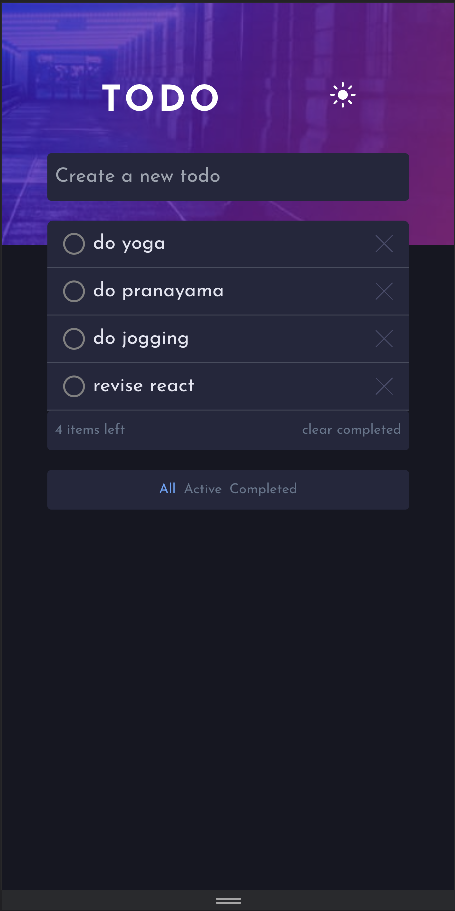
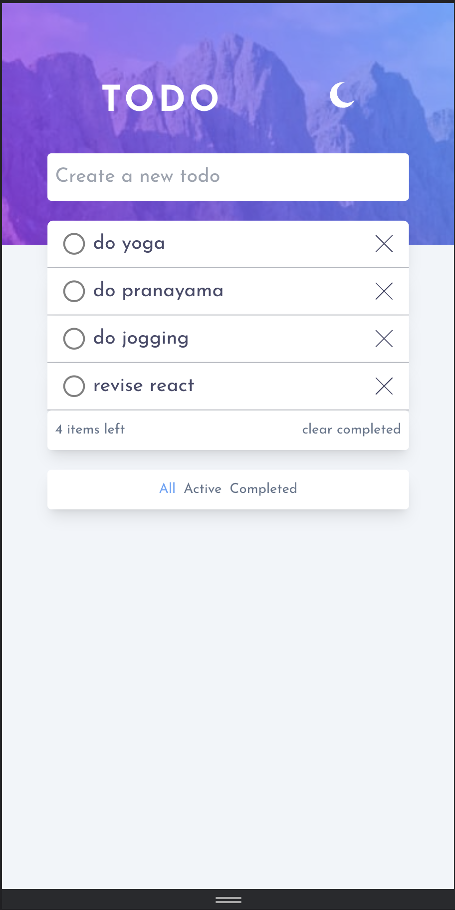

# Frontend Mentor - Todo app solution

This is a solution to the [Todo app challenge on Frontend Mentor](https://www.frontendmentor.io/challenges/todo-app-Su1_KokOW). Frontend Mentor challenges help you improve your coding skills by building realistic projects. 

## Table of contents

- [Overview](#overview)
  - [The challenge](#the-challenge)
  - [Screenshot](#screenshot)
  - [Links](#links)
- [My process](#my-process)
  - [Procedure](#procedure)
  - [Built With](#built-with)
  - [What I learned](#what-i-learned)
  - [Continued development](#continued-development)
- [Author](#author)

**Note: Delete this note and update the table of contents based on what sections you keep.**

## Overview

### The challenge

Users should be able to:

- View the optimal layout for the app depending on their device's screen size
- See hover states for all interactive elements on the page
- Add new todos to the list
- Mark todos as complete
- Delete todos from the list
- Filter by all/active/complete todos
- Clear all completed todos
- Toggle light and dark mode
- **Bonus**: Drag and drop to reorder items on the list

### Screenshot

### Links

- Solution URL: [Add solution URL here](https://your-solution-url.com)
- Live Site URL: [Add live site URL here](https://your-live-site-url.com)

## My process

### Procedure

- First i created simple layout without using any state or logic just created UI.
- Then i used tailwind to style the components.
- and after completing the UI. I added the logic and created states.
- And in last some final touch ups and drag and drop functionality.

### Built with

- Semantic HTML5 markup
- CSS custom properties
- Flexbox
- Mobile-first workflow
- [React](https://reactjs.org/) - JS library
- [Tailwind Css](https://tailwindcss.com/) - CSS library

### What I learned

I am improving my skills in react by completing these challenges.

To see how you can add code snippets, see below:

### Continued development

Can add login and sign up feature so that user's todo list will maintained and always fetched from database.

## Author

- Frontend Mentor - [@Ashishkandpal](https://www.frontendmentor.io/profile/Ashishkandpal)

